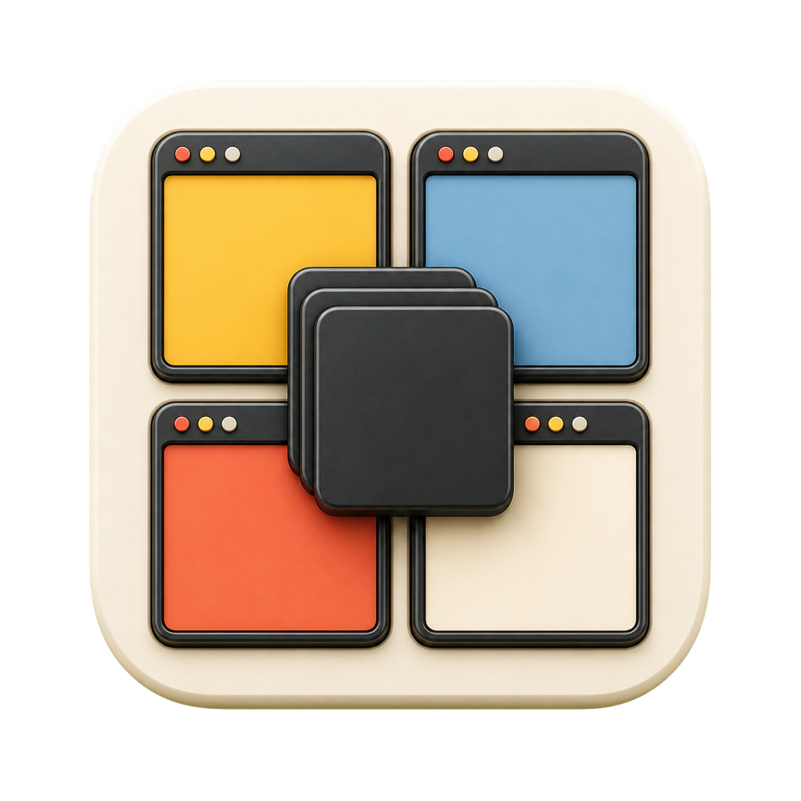
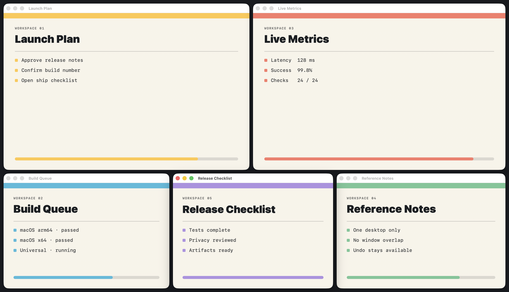

<p align="center">
  
</p>

<h1 align="center">StepAside</h1>

<p align="center">
  One click turns a crowded macOS desktop into a dense, usable, non-overlapping workspace.
</p>

<p align="center">
  <a href="https://github.com/LawrenceRiver/stepaside-macos/actions/workflows/ci.yml"></a>
  <a href="https://github.com/LawrenceRiver/stepaside-macos/releases"></a>
  
  
  <a href="LICENSE"></a>
</p>

<p align="center">
  <a href="https://github.com/LawrenceRiver/stepaside-macos/releases/tag/v1.0.0-rc1"></a>
  <a href="#build-and-test"></a>
</p>



_A real five-window result on macOS. An Accessibility-trusted local showcase host invoked this repository's production `ArrangementCoordinator` and `LayoutEngine`; the packaged app did not trigger the capture because that build had not been granted macOS Accessibility permission. The windows contain synthetic data only, and the image is not a conceptual composite._

## One action, one desktop

StepAside is a small Swift menu-bar app for the desktop you are looking at now. It discovers eligible on-screen windows, calculates a practical layout for each display, applies the frames, and keeps the previous arrangement ready for Undo.

1. Grant Accessibility permission once during onboarding.
2. Left-click the StepAside menu-bar icon, or press `Control-Option-S`.
3. Keep working in every arranged window; right-click **Undo** to restore the previous frames.

There is no Space switch, overview mode, or window thumbnail layer. StepAside resizes the real app windows in place.

## What it handles

- Arranges ordinary windows visible on the current desktop in one click.
- Solves every connected display independently without moving windows between displays.
- Preserves minimum sizes, configurable spacing, containment, and non-overlap.
- Treats non-resizable movable windows as fixed obstacles and lays out around them.
- Verifies the frames apps actually accept and retries a constrained frame once.
- Skips ambiguous or unsupported windows instead of guessing.
- Restores the most recent pre-arrangement frames with Undo.

Right-click the menu-bar icon for **Arrange**, **Undo**, **Launch at Login**, **Settings**, and **Quit**. Compact, Balanced, and Airy spacing presets are available in Settings.

## Install the prerelease

The current public build is [`v1.0.0-rc1`](https://github.com/LawrenceRiver/stepaside-macos/releases/tag/v1.0.0-rc1), an ad-hoc signed, non-notarized release candidate for evaluation.

1. Download and open `StepAside.dmg` from the release.
2. Drag **StepAside** to **Applications**.
3. Launch it. If Gatekeeper blocks the ad-hoc build, Control-click the app and choose **Open**.
4. Follow the in-app guide to enable StepAside in **System Settings → Privacy & Security → Accessibility**, then return to Settings and check again.

Accessibility permission is required only to identify, move, and resize eligible windows. It is revocable at any time. Production distribution should use Developer ID signing and Apple notarization; the maintainer procedure is documented in [RELEASE.md](RELEASE.md).

## Build and test

Requirements: macOS 14 or later, Xcode with Swift 6.2 or later, and Command Line Tools selected with `xcode-select`.

```bash
git clone https://github.com/LawrenceRiver/stepaside-macos.git
cd stepaside-macos
make test
make app
make dmg
```

`make test` runs the deterministic core suite. `make app` assembles `dist/StepAside.app`; `make dmg` also creates `dist/StepAside.dmg`. The default package is an ad-hoc signed universal `arm64` + `x86_64` build. CI builds, tests, packages, verifies the signature, and rejects private CGS, SLS, or SkyLight imports.

To produce a Developer ID-signed artifact locally:

```bash
CODESIGN_IDENTITY="Developer ID Application: Your Name (TEAMID)" make dmg
```

## How it works

StepAside keeps platform access separate from layout policy:

```text
Core Graphics on-screen list + Accessibility windows
                         │
                  safe PID/title/geometry match
                         │
           per-display deterministic layout engine
                         │
             apply → verify → retry once → Undo
```

The `StepAsideCore` module owns geometry, matching, layout invariants, and transaction coordination. `MacWindowSystem` is the concrete adapter for public Core Graphics and Accessibility APIs. The SwiftUI/AppKit shell owns the menu-bar item, settings, shortcut, launch-at-login toggle, and nonactivating result message.

Read [ARCHITECTURE.md](ARCHITECTURE.md) for matching rules, display coordinate conversion, layout guarantees, and the public-API boundary.

## Privacy and boundaries

StepAside works locally and has no analytics, advertising, crash upload, updater, or other network client. It does not capture pixels, read documents or messages, inspect passwords, read the clipboard, log keystrokes, or persist window titles. Undo frames live in memory only; preferences and generic result copy use `UserDefaults`.

For the precise data policy, see [PRIVACY.md](PRIVACY.md).

StepAside deliberately does not:

- rearrange inactive Spaces or silently switch desktops;
- move full-screen, minimized, modal, or ambiguous windows;
- move a window away from its source display;
- use private WindowServer APIs;
- promise a placement when the requested windows cannot safely fit.

## Release status

`v1.0.0-rc1` is a public prerelease. Automated core tests and release-package checks are in CI, while Accessibility onboarding and real-window behavior still require the manual macOS acceptance matrix in [RELEASE.md](RELEASE.md). Changes are recorded in [CHANGELOG.md](CHANGELOG.md).

## Contributing

Focused issues and pull requests are welcome. Please read [CONTRIBUTING.md](CONTRIBUTING.md), preserve the documented layout and privacy invariants, and run `make test` before opening a pull request.

## License

StepAside is available under the [MIT License](LICENSE).
